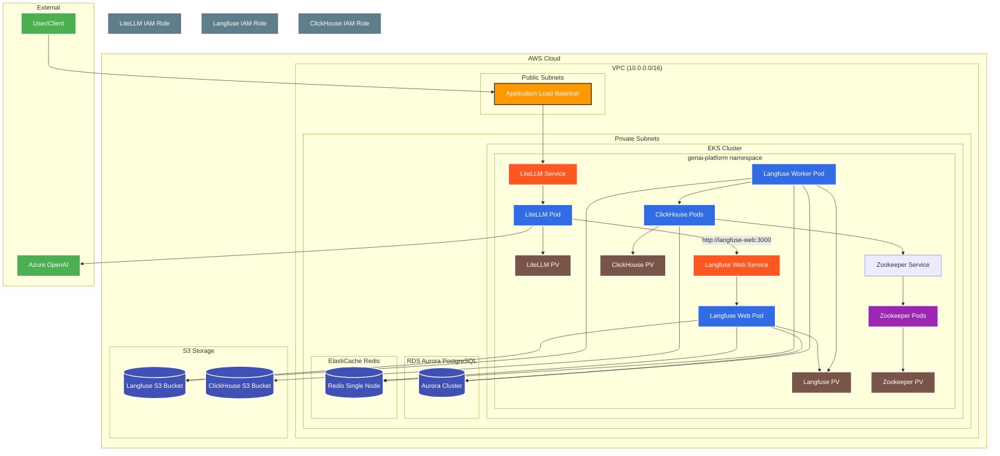
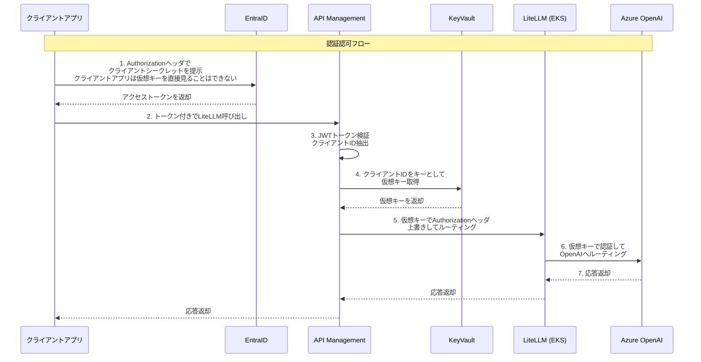

# GenAI Platform Infrastructure

検証用サーバ環境構築の過程など<br>
操作する上の基本的な内容（Terraform実行環境の構築、EKSできたら認証とる、とか、そういうこと）は書きません。<br>

## 1. 構成図
Cursor（Mermaid）で作成。随時更新予定。



## 2. 事前準備
 - AWS
 - Terraform
 - kubectl
 - helm
 - Azure OpenAI （例：gpt-4o-miniをデプロイ）
 - （Option）コーディングAI（例：Github Coplot, Cursor）

## 3. AWSリソースの構築
src/のtfファイルをご参照。随時更新。<br>
EKS Auto Mode、Aurora、Redis、S3、IAM、VPCなど<br>
エンタ押すだけ、15分ぐらい。<br>
検証用のためセキュアでも何でもない（あまりそこはやらない予定）<br>

## 4. LiteLLMデプロイ
以降、まだかなり手動作業残る状態。徐々にコツコツ改善予定。<br>

### 4.1 k8s名前空間を作成。
```bash
kubectl apply -f k8s/namespace.yaml
```

### 4.2 LiteLLM立ち上げ
terraformのoutputを元に下記のファイルを修正して適用。<br>
src/k8s/mylitellm.yaml<br>
```bash
kubectl apply -f k8s/mylitellm.yaml
```

### 4.3 Ingress立ち上げ
現状はlangfuse用もまとめて立ち上げ。<br>
```bash
kubectl apply -f k8s/myingress.yaml
```

### 4.4 動作確認
数分待ってから下記の観点で確認する。
 - [ALBのURL]：LiteLLMのOpenAPI定義が確認できること。
 - [ALBのURL]/ui：LiteLLMの管理画面が表示されること。ログインして事前に登録しているモデルが確認できること。
 - curlリクエスト：LiteLLM越しにAzure OpenAIにリクエストして、LiteLLMの管理画面でログが確認できること。
 ```bash
 curl -X POST "[ALBのURL]/v1/chat/completions" \
  -H "Content-Type: application/json" \
  -H "Authorization: Bearer [LiteLLM Key]" \
  -d '{
    "model": "[YOUR_LLM_MODEL]",
    "messages": [
      {
        "role": "user",
        "content": "こんにちは！LiteLLMのテストです。"
      }
    ]
  }'
 ```

## 5. Langfuseデプロイ
まだまだ手動手順が残る状況。徐々に改善予定。<br>

### 5.1 Langfuse用のSecret、ConfigMap、StorageClass
src/k8s/mylangfuse.yamlを更新して適用する。
```bash
kubectl apply -f k8s/myingress.yaml
```

### 5.2 Helmでインストール
（まだ試行錯誤中）<br>
src/helm/values.yamlを更新して適用する。
```bash
# Helmリポジトリ追加
helm repo add langfuse https://langfuse.github.io/langfuse-k8s
helm repo update

# Langfuseデプロイ
helm install langfuse langfuse/langfuse -n genai-platform -f helm/values.yaml

# アンインストールするとき
helm uninstall langfuse -n genai-platform
```

### 5.3 事後作業（工事中）
現時点で残ってしまっている残作業<br>
その１）サービスアカウントへのアノテーション付与<br>
helmインストールではできず、手動になっている。<br>
下記の2つの対応が必要。<br>
- langfuse-web, langfuse-workerのサービスアカウントへのIAMロールARNのアノテーション
- langfuse-clickhouseのサービスアカウントへのIAMロールARNのアノテーション
```bash
kubectl annotate serviceaccount langfuse -n genai-platform eks.amazonaws.com/role-arn=[YOUR_LANGFUSE_ROLE_ARN]
kubectl annotate serviceaccount langfuse -n genai-platform eks.amazonaws.com/role-arn=[YOUR_CLICKHOUSE_ROLE_ARN]
```
実行後は再起動が必要。
```bash
# Langfuse全コンポーネントの再起動
kubectl rollout restart deployment langfuse-web -n genai-platform
kubectl rollout restart deployment langfuse-worker -n genai-platform
kubectl rollout restart statefulset langfuse-clickhouse-shard0 -n genai-platform
```
その２）ClickHouseのConfigMapパッチ<br>
これもHelmインストール時にできるはずなのだが、現状は手作業。。
```bash
kubectl patch statefulset langfuse-clickhouse-shard0 -n genai-platform --type='json' -p='[{"op": "add", "path": "/spec/template/spec/volumes/-", "value": {"name": "clickhouse-s3-config", "configMap": {"name": "clickhouse-s3-config"}}}, {"op": "add", "path": "/spec/template/spec/containers/0/volumeMounts/-", "value": {"name": "clickhouse-s3-config", "mountPath": "/etc/clickhouse-server/config.d/s3disk.xml", "subPath": "s3disk.xml"}}]'
```

### 5.4 動作確認＆LiteLLM連結
数分待ってから下記の観点で確認、作業する。
 - [ALBのURL]：Langfuseのログイン画面が表示されること。初回は新規アカウント作成を行い、管理画面に侵入する。
 - プロジェクトのパブリックキーとシークレットキーを生成し、LiteLLMに登録する。
 - curlリクエスト：先ほどと同じくLiteLLM越しにAzure OpenAIにリクエストする。
 - Langfuseの管理画面でトレースが見れることを確認する。
 - Langfuse用のS3にデータができていることを確認する。
 - Clickhouse用のS3に大量のプレフィクスができていることを確認する。

## 6. 1日の終わりに必ず実施すること
```bash
terraform destroy
```

## 7. 認証認可統合 EntraID,API Management側の検証
クライアントにLiteLLMのキーを見せずに認可する、というのが主題。<br>
API ManagmentでJWT内のクライアントID毎に、動的にKey Vaultに格納されたLiteLLMのキーを取得する、ということを実施。<br>
実際にこの方式なのかは別途検討が必要<br>
10/10 １段落したので整理してクロージング<br>

### 7.1 構成図



### 7.2 EntraIDの設定
下記を参考に設定を行う。<br>
参考）https://learn.microsoft.com/ja-jp/azure/api-management/api-management-howto-protect-backend-with-aad#register-an-application-in-microsoft-entra-id-to-represent-the-api

今回は下記を実施。
- LiteLLM（リソースAPI）のアプリケーション登録を行う。APIの公開、スコープの設定を行う。
- クライアントシステムのアプリケーション登録を行う。シークレットを払い出し、APIのアクセス許可を設定する。
  
### 7.3 KeyVaultの設定
- LiteLLMの仮想キーを、名称をEntraのクライアントアプリのクライアントID、 値をLiteLLMの仮想キーとして登録。
- 登録作業者のユーザにKey Vault Secrets Officer、API ManagementのマネージドIDにKey Vault Secrets Userを割り当て。

```bash

# 登録作業用ユーザへのKey Vault Secrets Officerの割り当て
az role assignment create --role "Key Vault Secrets Officer" --assignee "{作業者のユーザアカウント}" --scope "/subscriptions/{subscriptions}/resourceGroups/{resourceGroups}/providers/Microsoft.KeyVault/vaults/{vault name}"

# シークレットの登録
az keyvault secret set --vault-name "{vault name}" --name "{クライアントアプリのclient-id}" --value "{litellm key}"

# API ManagementのマネージドIDによるKey Vault Secrets Userの割り当て
az role assignment create --role "Key Vault Secrets User" --assignee "{API ManagementのマネージドID}" --scope "/subscriptions/{subscriptions}/resourceGroups/{resourceGroups}/providers/Microsoft.KeyVault/vaults/{vault name}"

```

### 7.4 APIManagementの設定
やはり覚悟はしていたもののポリシーは難しく、正常系だけの簡易実装。<br>
Named valueが動的参照できず、ビルド時に静的に名前を決めないといけないのも想定外。<br>
デバッグも大変で、API Management本体の診断設定の他、API毎にもApplication Insightを有効にしないとtraceログが出ませんでした。<br>
あと、手元に間違ったソースコードを持ってるからか、Cursorも間違えまくって一向に正解に辿り着かず。<br>
ポリシーでは下記を実装。実際にはJWT検証、JWTパースぐらいまでは確定かなと思ってます。認可君は一応形は確かめた程度で実際にどうするかは要検討。
- JWTトークン検証
- JWTからクライアントID（appid）を取得
- クライアントIDをキーとしてKeyVaultからREST API経由でLiteLLMの仮想キーを取得
- 仮想キーでAuthorizationヘッダーを書き換え
- LiteLLMへルーティング

```
<!--
    - Policies are applied in the order they appear.
    - Position <base/> inside a section to inherit policies from the outer scope.
    - Comments within policies are not preserved.
-->
<!-- Add policies as children to the <inbound>, <outbound>, <backend>, and <on-error> elements -->
<policies>
    <!-- Throttle, authorize, validate, cache, or transform the requests -->
    <inbound>
        <base />
        <!-- JWTトークン検証 -->
        <validate-jwt header-name="Authorization" failed-validation-httpcode="401">
            <openid-config url="https://login.microsoftonline.com/{tenant-id}/v2.0/.well-known/openid-configuration" />
            <audiences>
                <audience>api://{client-id}</audience>
            </audiences>
            <issuers>
                <issuer>https://sts.windows.net/{tenant-id}/</issuer>
            </issuers>
            <required-claims>
                <claim name="aud">
                    <value>api://{client-id}</value>
                </claim>
            </required-claims>
        </validate-jwt>

        <!-- JWTからクライアントID（appid）を取得 -->
        <set-variable name="client-id" value="@{
            var authHeader = context.Request.Headers.GetValueOrDefault("Authorization", "");
            if (authHeader.StartsWith("Bearer "))
            {
                var token = authHeader.Substring(7);
                try
                {
                    var parts = token.Split('.');
                    if (parts.Length == 3)
                    {
                        var payload = parts[1];
                        while (payload.Length % 4 != 0)
                        {
                            payload += "=";
                        }
                        var json = System.Text.Encoding.UTF8.GetString(System.Convert.FromBase64String(payload));
                        var tokenObj = Newtonsoft.Json.Linq.JObject.Parse(json);
                        return tokenObj["appid"]?.ToString() ?? "";
                    }
                }
                catch
                {
                    return "";
                }
            }
            return "";
        }" />

        <!-- Key Vault URLの設定 -->
        <set-variable name="keyvault-url" value="@{
            var clientId = context.Variables.GetValueOrDefault("client-id", "");
            return "https://{vault-name}.vault.azure.net/secrets/" + clientId + "?api-version=7.6";
        }" />
        <!-- client-idをキーとして、Key Vault REST API を呼び出す -->
        <send-request mode="new" response-variable-name="keyVaultResponse" timeout="20" ignore-error="false">
            <set-url>@(context.Variables.GetValueOrDefault("keyvault-url", ""))</set-url>
            <set-method>GET</set-method>
            <authentication-managed-identity resource="https://vault.azure.net" />
        </send-request>
       
        <!-- シークレット値の抽出とヘッダー設定 -->
        <choose>
            <when condition="@(((IResponse)context.Variables["keyVaultResponse"]).StatusCode == 200)">
                <set-variable name="secretValue" value="@{
                    try {
                        var json = ((IResponse)context.Variables["keyVaultResponse"]).Body.As<string>();
                        var tokenObj = Newtonsoft.Json.Linq.JObject.Parse(json);
                        return tokenObj["value"]?.ToString() ?? "";
                    } catch {
                        return "";
                    }
                }" />
                <set-header name="Authorization" exists-action="override">
                    <value>@("Bearer " + context.Variables.GetValueOrDefault("secretValue",""))</value>
                </set-header>
            </when>
            <otherwise>
                <set-header name="Authorization" exists-action="override">
                    <value>Bearer default-api-key</value>
                </set-header>
            </otherwise>
        </choose>

        <!-- バックエンドサービスの設定 -->
        <set-backend-service base-url="http://{backend-url}" />

    </inbound>
    <!-- Control if and how the requests are forwarded to services  -->
    <backend>
        <base />
    </backend>
    <!-- Customize the responses -->
    <outbound>
        <base />
    </outbound>
    <!-- Handle exceptions and customize error responses  -->
    <on-error>
        <base />
    </on-error>
</policies>
```

### 7.5 動作確認
```bash
# 環境変数
export TENANT_ID="" # テナントID
export CLIENT_ID="" # クライアントアプリのクライアントID（リソースAPIのクライアントIDではない）
export CLIENT_SECRET="" # クライアントアプリのクライアントシークレット
export SCOPE="" # api://リソースAPIのURL/.default

# 環境変数を使用したトークン取得
TOKEN=$(curl -s -X POST "https://login.microsoftonline.com/$TENANT_ID/oauth2/v2.0/token" \
  -H "Content-Type: application/x-www-form-urlencoded" \
  -d "client_id=$CLIENT_ID" \
  -d "client_secret=$CLIENT_SECRET" \
  -d "scope=$SCOPE" \
  -d "grant_type=client_credentials" | jq -r '.access_token')

# API Management越しにLiteLLMを呼び出し
# ここにLiteLLMキーがないことが今回の狙い
curl -X POST "https://myapim20251009.azure-api.net/v1/chat/completions" \
 -H "Content-Type: application/json" \
 -H "Authorization: Bearer $TOKEN" \
 -d '{
   "model": "gpt-4o-mini",
   "messages": [
     {
       "role": "user",
       "content": "こんにちは！LiteLLMのテストです。"
     }
   ]
 }'
・・・
"message":{"content":"こんにちは！LiteLLMのテストですね。どのようにお手伝いできますか？"
・・・
```

## 8. LiteLLMのDB関連

### 8.1 テーブル定義
prismaファイルが下記に公開されているので、Cursorにテーブル定義とER図を作ってもらう。<br>
https://github.com/BerriAI/litellm/blob/main/schema.prisma<br>
LiteLLMのDBスキーマやER図については、以下のドキュメントも参照してください。

- [LiteLLM データベーススキーマ (database_schema.md)](src/doc/database_schema.md)
- [LiteLLM データベース ER図 (er_diagram.md)](src/doc/er_diagram.md)


