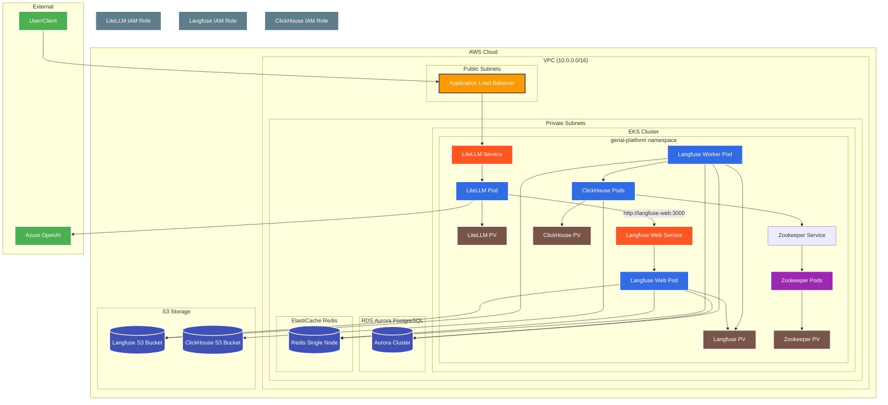

# GenAI Platform Infrastructure

検証用サーバ環境構築の過程など<br>
操作する上の基本的な内容（Terraform実行環境の構築、EKSできたら認証とる、とか、そういうこと）は書きません。<br>

## 1. 構成図
Cursor（Mermaid）で作成。随時更新予定。



## 2. 事前準備
 - AWS
 - Terraform
 - kubectl
 - helm
 - Azure OpenAI （例：gpt-4o-miniをデプロイ）
 - （Option）コーディングAI（例：Github Coplot, Cursor）

## 3. AWSリソースの構築
src/のtfファイルをご参照。随時更新。<br>
EKS Auto Mode、Aurora、Redis、S3、IAM、VPCなど<br>
エンタ押すだけ、15分ぐらい。<br>
検証用のためセキュアでも何でもない（あまりそこはやらない予定）<br>

## 4. LiteLLMデプロイ
以降、まだかなり手動作業残る状態。徐々にコツコツ改善予定。<br>

### 4.1 k8s名前空間を作成。
```bash
kubectl apply -f k8s/namespace.yaml
```

### 4.2 LiteLLM立ち上げ
terraformのoutputを元に下記のファイルを修正して適用。<br>
src/k8s/mylitellm.yaml<br>
```bash
kubectl apply -f k8s/mylitellm.yaml
```

### 4.3 Ingress立ち上げ
現状はlangfuse用もまとめて立ち上げ。<br>
```bash
kubectl apply -f k8s/myingress.yaml
```

### 4.4 動作確認
数分待ってから下記の観点で確認する。
 - [ALBのURL]：LiteLLMのOpenAPI定義が確認できること。
 - [ALBのURL]/ui：LiteLLMの管理画面が表示されること。ログインして事前に登録しているモデルが確認できること。
 - curlリクエスト：LiteLLM越しにAzure OpenAIにリクエストして、LiteLLMの管理画面でログが確認できること。
 ```bash
 curl -X POST "[ALBのURL]/v1/chat/completions" \
  -H "Content-Type: application/json" \
  -H "Authorization: Bearer [LiteLLM Key]" \
  -d '{
    "model": "[YOUR_LLM_MODEL]",
    "messages": [
      {
        "role": "user",
        "content": "こんにちは！LiteLLMのテストです。"
      }
    ]
  }'
 ```

## 5. Langfuseデプロイ
まだまだ手動手順が残る状況。徐々に改善予定。<br>

### 5.1 Langfuse用のSecret、ConfigMap、StorageClass
src/k8s/mylangfuse.yamlを更新して適用する。
```bash
kubectl apply -f k8s/myingress.yaml
```

### 5.2 Helmでインストール
（まだ試行錯誤中）<br>
src/helm/values.yamlを更新して適用する。
```bash
# Helmリポジトリ追加
helm repo add langfuse https://langfuse.github.io/langfuse-k8s
helm repo update

# Langfuseデプロイ
helm install langfuse langfuse/langfuse -n genai-platform -f helm/values.yaml

# アンインストールするとき
helm uninstall langfuse -n genai-platform
```

### 5.3 事後作業（工事中）
現時点で残ってしまっている残作業<br>
その１）サービスアカウントへのアノテーション付与<br>
helmインストールではできず、手動になっている。<br>
下記の2つの対応が必要。<br>
- langfuse-web, langfuse-workerのサービスアカウントへのIAMロールARNのアノテーション
- langfuse-clickhouseのサービスアカウントへのIAMロールARNのアノテーション
```bash
kubectl annotate serviceaccount langfuse -n genai-platform eks.amazonaws.com/role-arn=[YOUR_LANGFUSE_ROLE_ARN]
kubectl annotate serviceaccount langfuse -n genai-platform eks.amazonaws.com/role-arn=[YOUR_CLICKHOUSE_ROLE_ARN]
```
実行後は再起動が必要。
```bash
# Langfuse全コンポーネントの再起動
kubectl rollout restart deployment langfuse-web -n genai-platform
kubectl rollout restart deployment langfuse-worker -n genai-platform
kubectl rollout restart statefulset langfuse-clickhouse-shard0 -n genai-platform
```
その２）ClickHouseのConfigMapパッチ<br>
これもHelmインストール時にできるはずなのだが、現状は手作業。。
```bash
kubectl patch statefulset langfuse-clickhouse-shard0 -n genai-platform --type='json' -p='[{"op": "add", "path": "/spec/template/spec/volumes/-", "value": {"name": "clickhouse-s3-config", "configMap": {"name": "clickhouse-s3-config"}}}, {"op": "add", "path": "/spec/template/spec/containers/0/volumeMounts/-", "value": {"name": "clickhouse-s3-config", "mountPath": "/etc/clickhouse-server/config.d/s3disk.xml", "subPath": "s3disk.xml"}}]'
```

### 5.4 動作確認＆LiteLLM連結
数分待ってから下記の観点で確認、作業する。
 - [ALBのURL]：Langfuseのログイン画面が表示されること。初回は新規アカウント作成を行い、管理画面に侵入する。
 - プロジェクトのパブリックキーとシークレットキーを生成し、LiteLLMに登録する。
 - curlリクエスト：先ほどと同じくLiteLLM越しにAzure OpenAIにリクエストする。
 - Langfuseの管理画面でトレースが見れることを確認する。
 - Langfuse用のS3にデータができていることを確認する。
 - Clickhouse用のS3に大量のプレフィクスができていることを確認する。

## 6. 1日の終わりに必ず実施すること
```bash
terraform destroy
```