# GenAI Platform Infrastructure

> **⚠️ 注意事項**
> - 信じられないぐらいのボトムアップアプローチですが、ご了承ください。
> - 試行した時系列順に書き足しているため、前の章で変なこと書いても後の章で打ち消したりしています。 

操作する上の基本的な内容（Terraform実行環境の構築、EKSできたら認証とる、とか、そういうこと）は書きません。<br>

## 目次
- [0. 事前調査（2025/09/20）](#1-20250920)
- [1. 構成図（2025/10/05）](#1-構成図20251005)
- [2. 事前準備（2025/10/05）](#2-事前準備20251005)
- [3. AWSリソースの構築（2025/10/05）](#3-awsリソースの構築20251005)
- [4. LiteLLMデプロイ（2025/10/05）](#4-litellmデプロイ20251005)
  - [4.1 k8s名前空間を作成](#41-k8s名前空間を作成)
  - [4.2 LiteLLM立ち上げ](#42-litellm立ち上げ)
  - [4.3 Ingress立ち上げ](#43-ingress立ち上げ)
  - [4.4 動作確認](#44-動作確認)
- [5. Langfuseデプロイ（2025/10/05）](#5-langfuseデプロイ20251005)
  - [5.1 Langfuse用のSecret、ConfigMap、StorageClass](#51-langfuse用のsecretconfigmapstorageclass)
  - [5.2 Helmでインストール](#52-helmでインストール)
  - [5.3 事後作業](#53-事後作業)
  - [5.4 動作確認＆LiteLLM連結](#54-動作確認litellm連結)
- [6. 1日の終わりに必ず実施すること](#6-1日の終わりに必ず実施すること)
- [7. 認証認可統合 EntraID,API Management側の検証（2025/10/10）](#7-認証認可統合-entraidapi-management側の検証20251010)
  - [7.1 シーケンス図（2025/10/10）](#71-シーケンス図20251010)
  - [7.2 EntraIDの設定](#72-entraidの設定)
  - [7.3 KeyVaultの設定](#73-keyvaultの設定)
  - [7.4 APIManagementの設定](#74-apimanagementの設定)
  - [7.5 動作確認](#75-動作確認)
- [8. LiteLLMのDBを確認する（2025/10/11）](#8-litellmのdbを確認する20251011)
  - [8.1 テーブル定義](#81-テーブル定義)
  - [8.2 考察、シーケンス図修正](#82-考察シーケンス図修正)
- [9. 簡単なデモ（2025/10/11）](#9-簡単なデモ20251011)
  - [9.1 Streamlitのコード](#91-streamlitのコード)
  - [9.2 ビデオ](#92-ビデオ)
- [10. Langfuseの使い方（2025/10/12）](#10-langfuseの使い方20251012)
  - [10.1 テーブル定義とER](#101-テーブル定義とer)
  - [10.2 LiteLLMとLangfuseを統合した場合](#102-litellmとlangfuseを統合した場合)
  - [10.3 開発用途としてLangfuseの使い方](#103-開発用途としてlangfuseの使い方)
  - [10.4 Langfuseのプロジェクト案](#104-langfuseのプロジェクト案)
- [11. MCPの認証認可について（2025/10/13）](#11-mcpの認証認可について20251013)

## 0. 事前調査（2025/09/20）
[事前調査](./chapter0/README.md)

## 1. 構成図（2025/10/05）
Cursor（Mermaid）で作成。随時更新予定。
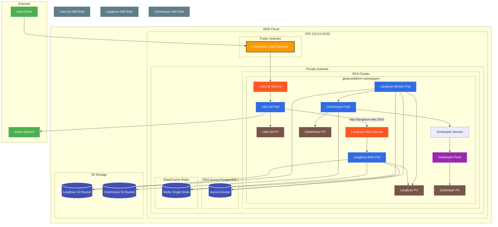


## 2. 事前準備（2025/10/05）
 - AWS
 - Terraform
 - kubectl
 - helm
 - Azure OpenAI （例：gpt-4o-miniをデプロイ）
 - （Option）コーディングAI（例：Github Coplot, Cursor）

## 3. AWSリソースの構築（2025/10/05）
src/のtfファイルをご参照。随時更新。<br>
EKS Auto Mode、Aurora、Redis、S3、IAM、VPCなど<br>
エンタ押すだけ、15分ぐらい。<br>
検証用のためセキュアでも何でもない（あまりそこはやらない予定）<br>

## 4. LiteLLMデプロイ（2025/10/05）
以降、まだかなり手動作業残る状態。徐々にコツコツ改善予定。<br>

### 4.1 k8s名前空間を作成。
```bash
kubectl apply -f k8s/namespace.yaml
```

### 4.2 LiteLLM立ち上げ
terraformのoutputを元に下記のファイルを修正して適用。<br>
src/k8s/mylitellm.yaml<br>
```bash
kubectl apply -f k8s/mylitellm.yaml
```

### 4.3 Ingress立ち上げ
現状はlangfuse用もまとめて立ち上げ。<br>
```bash
kubectl apply -f k8s/myingress.yaml
```

### 4.4 動作確認
数分待ってから下記の観点で確認する。
 - [ALBのURL]：LiteLLMのOpenAPI定義が確認できること。
 - [ALBのURL]/ui：LiteLLMの管理画面が表示されること。ログインして事前に登録しているモデルが確認できること。
 - curlリクエスト：LiteLLM越しにAzure OpenAIにリクエストして、LiteLLMの管理画面でログが確認できること。
 ```bash
 curl -X POST "[ALBのURL]/v1/chat/completions" \
  -H "Content-Type: application/json" \
  -H "Authorization: Bearer [LiteLLM Key]" \
  -d '{
    "model": "[YOUR_LLM_MODEL]",
    "messages": [
      {
        "role": "user",
        "content": "こんにちは！LiteLLMのテストです。"
      }
    ]
  }'
 ```

## 5. Langfuseデプロイ（2025/10/05）
まだまだ手動手順が残る状況。徐々に改善予定。<br>

### 5.1 Langfuse用のSecret、ConfigMap、StorageClass
src/k8s/mylangfuse.yamlを更新して適用する。
```bash
kubectl apply -f k8s/myingress.yaml
```

### 5.2 Helmでインストール
（まだ試行錯誤中）<br>
src/helm/values.yamlを更新して適用する。
```bash
# Helmリポジトリ追加
helm repo add langfuse https://langfuse.github.io/langfuse-k8s
helm repo update

# Langfuseデプロイ
helm install langfuse langfuse/langfuse -n genai-platform -f helm/values.yaml

# アンインストールするとき
helm uninstall langfuse -n genai-platform
```

### 5.3 事後作業
現時点で残ってしまっている残作業<br>
その１）サービスアカウントへのアノテーション付与<br>
helmインストールではできず、手動になっている。<br>
下記の2つの対応が必要。<br>
- langfuse-web, langfuse-workerのサービスアカウントへのIAMロールARNのアノテーション
- langfuse-clickhouseのサービスアカウントへのIAMロールARNのアノテーション
```bash
kubectl annotate serviceaccount langfuse -n genai-platform eks.amazonaws.com/role-arn=[YOUR_LANGFUSE_ROLE_ARN]
kubectl annotate serviceaccount langfuse -n genai-platform eks.amazonaws.com/role-arn=[YOUR_CLICKHOUSE_ROLE_ARN]
```
実行後は再起動が必要。
```bash
# Langfuse全コンポーネントの再起動
kubectl rollout restart deployment langfuse-web -n genai-platform
kubectl rollout restart deployment langfuse-worker -n genai-platform
kubectl rollout restart statefulset langfuse-clickhouse-shard0 -n genai-platform
```
その２）ClickHouseのConfigMapパッチ<br>
これもHelmインストール時にできるはずなのだが、現状は手作業。。
```bash
kubectl patch statefulset langfuse-clickhouse-shard0 -n genai-platform --type='json' -p='[{"op": "add", "path": "/spec/template/spec/volumes/-", "value": {"name": "clickhouse-s3-config", "configMap": {"name": "clickhouse-s3-config"}}}, {"op": "add", "path": "/spec/template/spec/containers/0/volumeMounts/-", "value": {"name": "clickhouse-s3-config", "mountPath": "/etc/clickhouse-server/config.d/s3disk.xml", "subPath": "s3disk.xml"}}]'
```

### 5.4 動作確認＆LiteLLM連結
数分待ってから下記の観点で確認、作業する。
 - [ALBのURL]：Langfuseのログイン画面が表示されること。初回は新規アカウント作成を行い、管理画面に侵入する。
 - プロジェクトのパブリックキーとシークレットキーを生成し、LiteLLMに登録する。
 - curlリクエスト：先ほどと同じくLiteLLM越しにAzure OpenAIにリクエストする。
 - Langfuseの管理画面でトレースが見れることを確認する。
 - Langfuse用のS3にデータができていることを確認する。
 - Clickhouse用のS3に大量のプレフィクスができていることを確認する。

## 6. 1日の終わりに必ず実施すること
```bash
terraform destroy
```

## 7. 認証認可統合 EntraID,API Management側の検証（2025/10/10）
クライアントにLiteLLMのキーを見せずに認可する、というのが主題。<br>
API ManagmentでJWT内のクライアントID毎に、動的にKey Vaultに格納されたLiteLLMのキーを取得する、ということを実施。<br>
実際にこの方式なのかは別途検討が必要<br>
10/10 １段落したので整理してクロージング<br>

### 7.1 シーケンス図（2025/10/10）

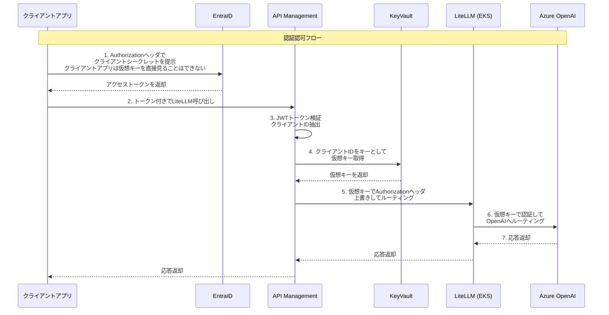

### 7.2 EntraIDの設定
下記を参考に設定を行う。<br>
参考）https://learn.microsoft.com/ja-jp/azure/api-management/api-management-howto-protect-backend-with-aad#register-an-application-in-microsoft-entra-id-to-represent-the-api

今回は下記を実施。
- LiteLLM（リソースAPI）のアプリケーション登録を行う。APIの公開、スコープの設定を行う。
- クライアントシステムのアプリケーション登録を行う。シークレットを払い出し、APIのアクセス許可を設定する。
  
### 7.3 KeyVaultの設定
- LiteLLMの仮想キーを、名称をEntraのクライアントアプリのクライアントID、 値をLiteLLMの仮想キーとして登録。
- 登録作業者のユーザにKey Vault Secrets Officer、API ManagementのマネージドIDにKey Vault Secrets Userを割り当て。

```bash

# 登録作業用ユーザへのKey Vault Secrets Officerの割り当て
az role assignment create --role "Key Vault Secrets Officer" --assignee "{作業者のユーザアカウント}" --scope "/subscriptions/{subscriptions}/resourceGroups/{resourceGroups}/providers/Microsoft.KeyVault/vaults/{vault name}"

# シークレットの登録
az keyvault secret set --vault-name "{vault name}" --name "{クライアントアプリのclient-id}" --value "{litellm key}"

# API ManagementのマネージドIDによるKey Vault Secrets Userの割り当て
az role assignment create --role "Key Vault Secrets User" --assignee "{API ManagementのマネージドID}" --scope "/subscriptions/{subscriptions}/resourceGroups/{resourceGroups}/providers/Microsoft.KeyVault/vaults/{vault name}"

```

### 7.4 APIManagementの設定
やはり覚悟はしていたもののポリシーは難しく、正常系だけの簡易実装。<br>
Named valueが動的参照できず、ビルド時に静的に名前を決めないといけないのも想定外。<br>
デバッグも大変で、API Management本体の診断設定の他、API毎にもApplication Insightを有効にしないとtraceログが出ませんでした。<br>
あと、手元に間違ったソースコードを持ってるからか、Cursorも間違えまくって一向に正解に辿り着かず。<br>
ポリシーでは下記を実装。実際にはJWT検証、JWTパースぐらいまでは確定かなと思ってます。認可君は一応形は確かめた程度で実際にどうするかは要検討。
- JWTトークン検証
- JWTからクライアントID（appid）を取得
- クライアントIDをキーとしてKeyVaultからREST API経由でLiteLLMの仮想キーを取得
- 仮想キーでAuthorizationヘッダーを書き換え
- LiteLLMへルーティング

```
<!--
    - Policies are applied in the order they appear.
    - Position <base/> inside a section to inherit policies from the outer scope.
    - Comments within policies are not preserved.
-->
<!-- Add policies as children to the <inbound>, <outbound>, <backend>, and <on-error> elements -->
<policies>
    <!-- Throttle, authorize, validate, cache, or transform the requests -->
    <inbound>
        <base />
        <!-- JWTトークン検証 -->
        <validate-jwt header-name="Authorization" failed-validation-httpcode="401">
            <openid-config url="https://login.microsoftonline.com/{tenant-id}/v2.0/.well-known/openid-configuration" />
            <audiences>
                <audience>api://{client-id}</audience>
            </audiences>
            <issuers>
                <issuer>https://sts.windows.net/{tenant-id}/</issuer>
            </issuers>
            <required-claims>
                <claim name="aud">
                    <value>api://{client-id}</value>
                </claim>
            </required-claims>
        </validate-jwt>

        <!-- JWTからクライアントID（appid）を取得 -->
        <set-variable name="client-id" value="@{
            var authHeader = context.Request.Headers.GetValueOrDefault("Authorization", "");
            if (authHeader.StartsWith("Bearer "))
            {
                var token = authHeader.Substring(7);
                try
                {
                    var parts = token.Split('.');
                    if (parts.Length == 3)
                    {
                        var payload = parts[1];
                        while (payload.Length % 4 != 0)
                        {
                            payload += "=";
                        }
                        var json = System.Text.Encoding.UTF8.GetString(System.Convert.FromBase64String(payload));
                        var tokenObj = Newtonsoft.Json.Linq.JObject.Parse(json);
                        return tokenObj["appid"]?.ToString() ?? "";
                    }
                }
                catch
                {
                    return "";
                }
            }
            return "";
        }" />

        <!-- Key Vault URLの設定 -->
        <set-variable name="keyvault-url" value="@{
            var clientId = context.Variables.GetValueOrDefault("client-id", "");
            return "https://{vault-name}.vault.azure.net/secrets/" + clientId + "?api-version=7.6";
        }" />
        <!-- client-idをキーとして、Key Vault REST API を呼び出す -->
        <send-request mode="new" response-variable-name="keyVaultResponse" timeout="20" ignore-error="false">
            <set-url>@(context.Variables.GetValueOrDefault("keyvault-url", ""))</set-url>
            <set-method>GET</set-method>
            <authentication-managed-identity resource="https://vault.azure.net" />
        </send-request>
       
        <!-- シークレット値の抽出とヘッダー設定 -->
        <choose>
            <when condition="@(((IResponse)context.Variables["keyVaultResponse"]).StatusCode == 200)">
                <set-variable name="secretValue" value="@{
                    try {
                        var json = ((IResponse)context.Variables["keyVaultResponse"]).Body.As<string>();
                        var tokenObj = Newtonsoft.Json.Linq.JObject.Parse(json);
                        return tokenObj["value"]?.ToString() ?? "";
                    } catch {
                        return "";
                    }
                }" />
                <set-header name="Authorization" exists-action="override">
                    <value>@("Bearer " + context.Variables.GetValueOrDefault("secretValue",""))</value>
                </set-header>
            </when>
            <otherwise>
                <set-header name="Authorization" exists-action="override">
                    <value>Bearer default-api-key</value>
                </set-header>
            </otherwise>
        </choose>

        <!-- バックエンドサービスの設定 -->
        <set-backend-service base-url="http://{backend-url}" />

    </inbound>
    <!-- Control if and how the requests are forwarded to services  -->
    <backend>
        <base />
    </backend>
    <!-- Customize the responses -->
    <outbound>
        <base />
    </outbound>
    <!-- Handle exceptions and customize error responses  -->
    <on-error>
        <base />
    </on-error>
</policies>
```

### 7.5 動作確認
```bash
# 環境変数
export TENANT_ID="" # テナントID
export CLIENT_ID="" # クライアントアプリのクライアントID（リソースAPIのクライアントIDではない）
export CLIENT_SECRET="" # クライアントアプリのクライアントシークレット
export SCOPE="" # api://リソースAPIのURL/.default

# 環境変数を使用したトークン取得
TOKEN=$(curl -s -X POST "https://login.microsoftonline.com/$TENANT_ID/oauth2/v2.0/token" \
  -H "Content-Type: application/x-www-form-urlencoded" \
  -d "client_id=$CLIENT_ID" \
  -d "client_secret=$CLIENT_SECRET" \
  -d "scope=$SCOPE" \
  -d "grant_type=client_credentials" | jq -r '.access_token')

# API Management越しにLiteLLMを呼び出し
# ここにLiteLLMキーがないことが今回の狙い
curl -X POST "https://myapim20251009.azure-api.net/v1/chat/completions" \
 -H "Content-Type: application/json" \
 -H "Authorization: Bearer $TOKEN" \
 -d '{
   "model": "gpt-4o-mini",
   "messages": [
     {
       "role": "user",
       "content": "こんにちは！LiteLLMのテストです。"
     }
   ]
 }'
・・・
"message":{"content":"こんにちは！LiteLLMのテストですね。どのようにお手伝いできますか？"
・・・
```

## 8. LiteLLMのDBを確認する（2025/10/11）

### 8.1 テーブル定義
prismaファイルが下記に公開されているので、Cursorにテーブル定義とER図を作ってもらう。<br>
https://github.com/BerriAI/litellm/blob/main/schema.prisma<br>
LiteLLMのDBスキーマやER図については、以下のドキュメントも参照してください。

- [LiteLLM データベーススキーマ (database_schema.md)](src/doc/litellm/database_schema.md)
- [LiteLLM データベース ER図 (er_diagram.md)](src/doc/litellm/er_diagram.md)

### 8.2 考察、シーケンス図修正
随筆
- ER図を見ると、ユーザとキーは１対他なので、７章でやったようなことは出来なさそう（ユーザ毎に仮想キーは1つではない）
- やはりユーザ側からキーを指定してもらう必要があり、LiteLLM側ではカスタムヘッダでEntraIDのトークンとは別のヘッダでキーを受け取る
- 認可君みたいなものは不要でAPI ManagementはEntraのJWT検証のみ
- 何か特別な要件があればKeyVault、Named Valueあたりは使うことがあるかもしれない。動的にKeyVaultからREST APIで取るのはあまりやりたくない。
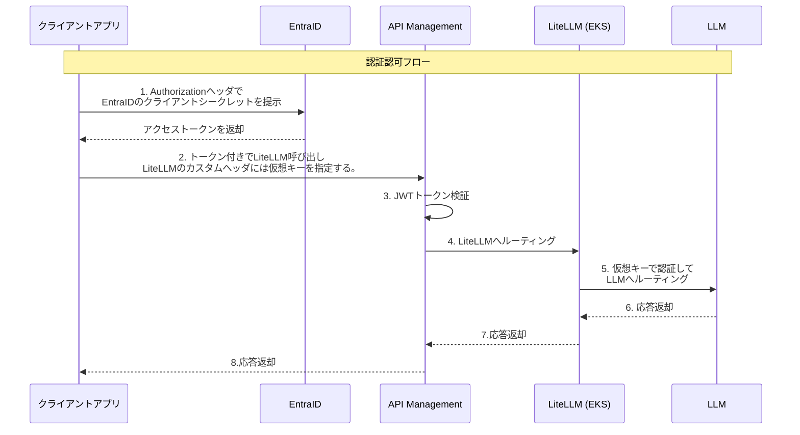

## 9. 簡単なデモ（2025/10/11）
- クライアントアプリをStreamlitで作成
- LLMは、Azureのgpt-4o-miniとGoogleのgemini/gemini-2.0-flash-liteを準備
- AWS上でTerraformしてLiteLLMを起動
- 仮想キーを払い出して、仮想キーを指定した場合は、gemini-2.0-flash-liteが使えない設定
- マスターキーを指定した場合は、両方使える、という状態。

### 9.1 Streamlitのコード
ソースコードはこちら
- [Streamlitソースコード](src/python/chat_app.py)

### 9.2 ビデオ
[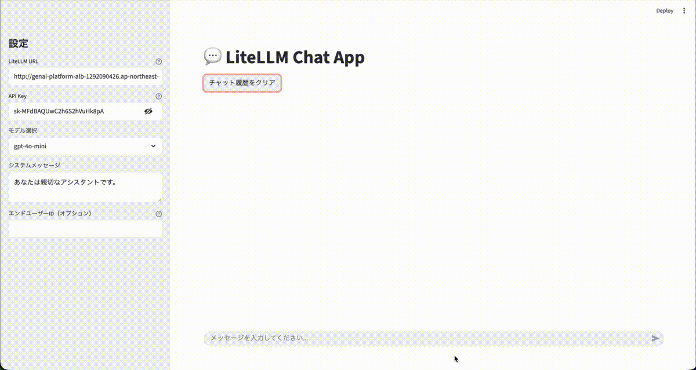]()

## 10. Langfuseの使い方（2025/10/12）

### 10.1 テーブル定義とER
LiteLLMと同じようにCursor氏に作成いただきました。
- [Langfuse データベーススキーマ (database_schema.md)](src/doc/langfuse/database_schema.md)
- [Langfuse データベース ER図 (er_diagram.md)](src/doc/langfuse/er_diagram.md)

### 10.2 LiteLLMとLangfuseを統合した場合
全てのログがLangfuseに流れる形になる。Langfuse側で専用のプロジェクトを作ってそこで全て受ける形になる想定。<br>
全てのログが流れるため特定の開発者がガンガン使うというのは難しく、運用上のログ可視化、もしくは、デバッグ用途、となりそう。<br>
例えば、チャットの同一セッションのログをLiteLLMで見ると、下記のように同一セッションであることはわかりにくい。
- チャットの同一セッションのログ表示例：
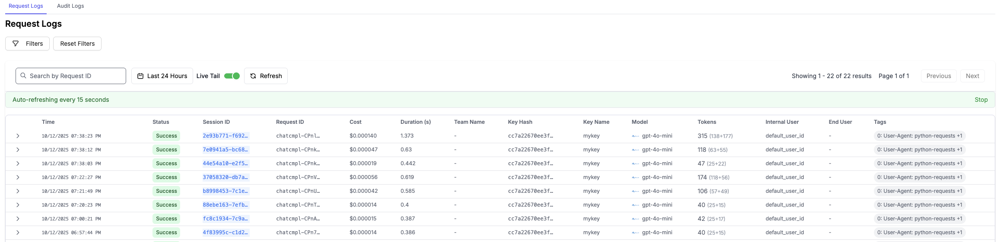
- Langfuseの方では下記のように見える。
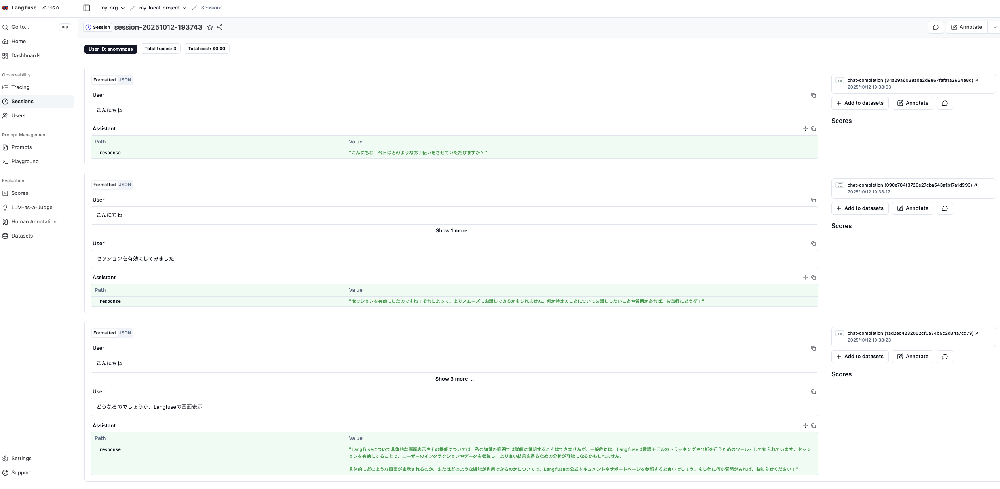

### 10.3 開発用途としてLangfuseの使い方
Langfuseで個別にプロジェクトを作成し、エンドポイントを開発者に公開、クライアントのSDKから直接呼んでもらうのが良いのではないかと考える。<br>
実際の運用環境では、チューニングしている間だけの期間限定とか、そういう感じになると思われるが（やはり申請承認が必要そう）、フル活用いただいて早期にチューニングを完了していただく方がAIエージェント開発の世界では良い気がしている。<br>
こちらの検証環境でも、litellmとは別プロジェクトを作成し、クライアントから呼び出すことができることを試した。<br>
ソースコードは前章のstreamlitを改変し、オンオフを切り替えられるようにしている。<br>

- [src/python/litellm-chat-app/chat_app.py](src/python/litellm-chat-app/chat_app.py)

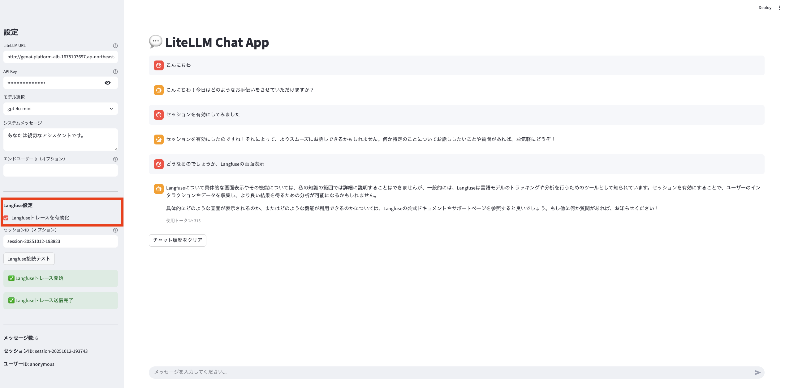

### 10.4 Langfuseのプロジェクト案
現時点では、上記の内容を踏まえて下記のように想定。

| 用途                  | 接続対象                      | 備考                           |
|---------------------|-----------------------|-------------------------------|
| 本番運用ログ用      | LiteLLM本番経由のLLMのすべての本番呼び出しを記録 | 運用状況の確認やトラブル対応 |
|本番環境でのチューニング用（個別払い出し）| 期間限定で個別払い出し、クライアントSDKで直撃いただく。定のアプリケーションのログのみを記録 | 本番環境でしかできないチューニングなど、目的もなく与えない、申請承認制|

## 11. MCPの認証認可について（2025/10/13）
AgentCoreなどのドキュメントを見る限り、MCPサーバーから見てインバウンドとアウトバウンドの双方の認証認可が必要、かつ、特にアウトバウンドについては、ユーザごと、情報リソースごとの認証認可を実現しないといけないように見える。
- インバウンド：MCPサーバーの利用が許可されているかの認証認可であり、これは通常のAPIの認証認可と同じ（ように見える）。
- アウトバウンド：MCPサーバから外部や社内のシステムの認証認可であり、複数のバリエーションが存在する。<br>
一番単純なのは、社内共有情報のようなケースで、社員であれば全員見ても良いような共有範囲の広いリソースの場合は、インバウンドが通っていれば情報収集しても良い、もしくは、MCPサーバとして単一の認証認可で済むかもしれない。<br>
一方で、例えば、Google Driveの自分のドライブだけAIエージェントやLLMに見せたい、のような場合は、アウトバウンドの認証認可において、ユーザに操作をしてもらって、その情報を他ユーザが共有できない形でMCPサーバで保持する。リクエスト時には、都度トークンが有効かを確認して情報リソースにアクセスする、のような形になる。<br>
例えが正しいかわからないが、BFFのような感じかと思いました。認証認可情報のセキュアストアやセッション分離などが必要で、リクエストに応じて、ユーザに成り変わりバックエンドに接続が必要。<br>
という風景なので、フルのカスタム開発は避けたく、
- 情報ソースは基本的にSaaS、実行基盤はPaaSという形にしたい
- オンプレミスのファイルサーバみたいなものはSaaSにデータ移送、もしくは、それができないぐらい機密なのであれば、チャットに手動で都度投下、
となってほしい。。

### 11.1 Agent Core Gatewayの探索
分けてこちらで実施中（2025/10/19）<br>
https://github.com/ryarai-pbgit/awsagentcoretest

## 12. Azure API ManagementのAI Gateway（2025/10/28）
少し試行してみたので、LiteLLMと比較して何点か記載。<br>

- gpt-4o-miniとgeminiを登録<br>
エンドポイントの統合という機能は無い。<br>
一回の設定で全てのAPIが自動的に登録されました。<br>
全体一括、もしくは、API個別で、従来のAPIManagementと同様の制御ができる。<br>
LiteLLMより細かく制御はできる（ニーズがあるかは微妙）<br>
OpenAIエンドポイントの例：  
  [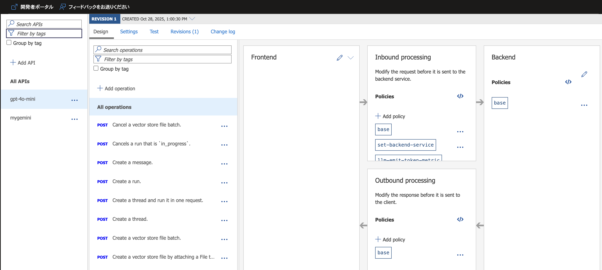](images/apim_openai.png)
Geminiエンドポイントの例：  
  [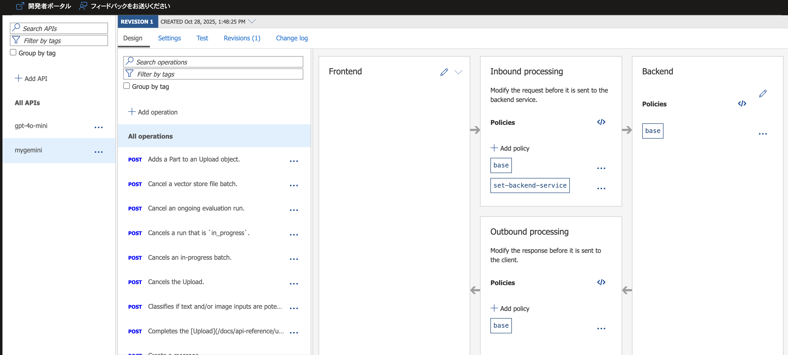](images/apim_gemini.png)

- ロードバランサー、サーキットブレーカー<br>
LLMのデプロイメントをIaaSとして扱うかの如く設定が可能。<br>
負荷分散アルゴリズムは少し違うように思いますが、LiteLLMとほぼ同等の設定が可能。<br>
バックエンドの設定例：  
[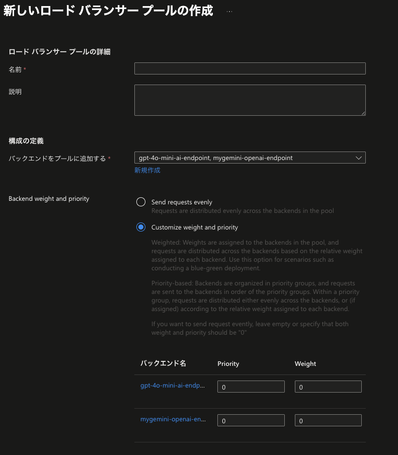](images/apim_backend.png)
サーキットブレーカーの設定例：  
[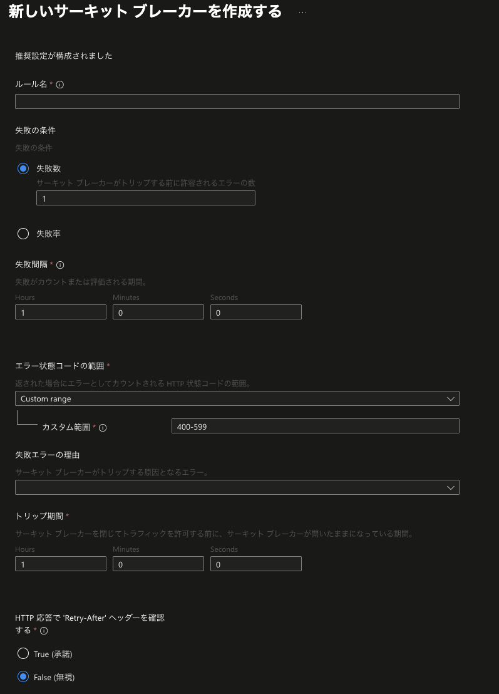](images/apim_circuitbreaker.png)

- ログ<br>
Kustoのクエリを組むことで見れるには見れる。（ただし、このクエリが紹介されている公式ドキュメントの記載が間違っている。10/28時点）<br>
LiteLLMよりも原始的な構造。開発やデバッグで利用するためには、別のツールが必要になる。<br>
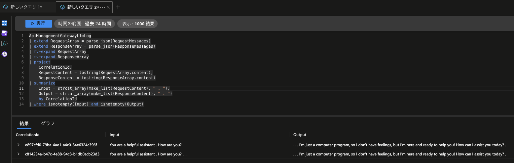

- 利用状況サマリ<br>
全体的なサマリ情報がグラフ表示される。見た目はLiteLLMともそう変わらない感じではある。<br>
実務で利用するのかはよくわからない。<br>
  [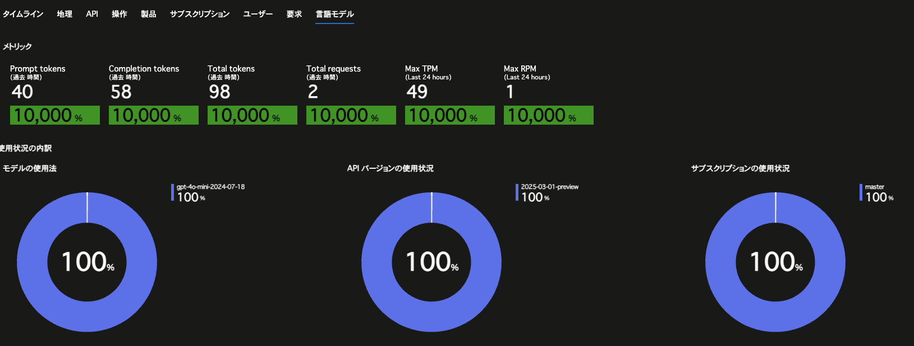](images/apim_analytics.png)

## 13. Azure Databricks Mosaic AI Gateway（2025/10/28）
Databricks Mosaic AI Gatewayも試行してみたので何点か記載。<br>

- gpt-4o-miniとgeminiを登録<br>
稼働確認のため50%ずつ振り分けるという通常あり得ない設定かもしれません。<br>
現実には、OpenAI系のバージョン違い、Geminiのバージョン違いをまとめてそれ毎にゲートウェイを作る形かと思います。<br>
今回はGUIで実施していますが、notebook経由でpythonのプログラム、Jsonの定義で登録も可能。
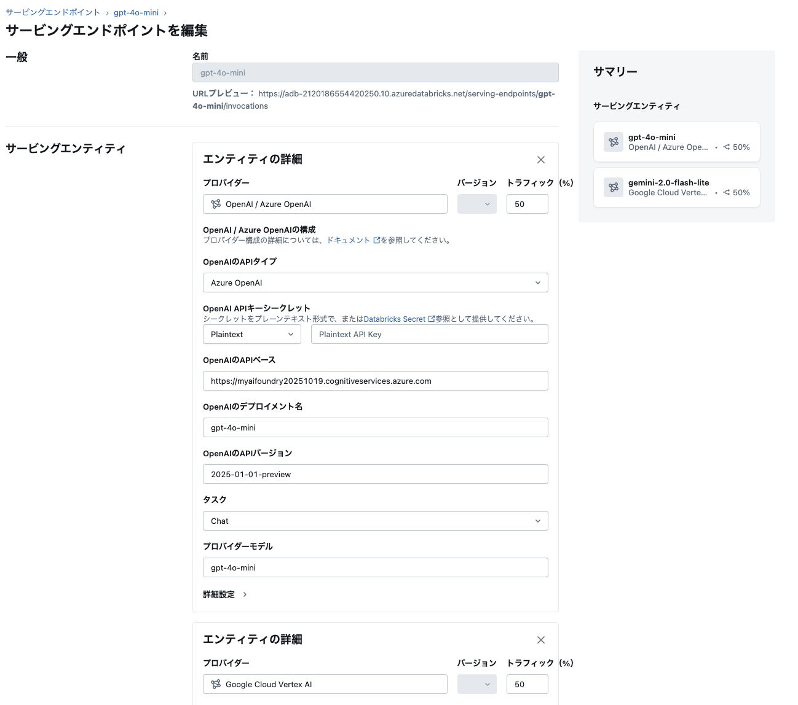
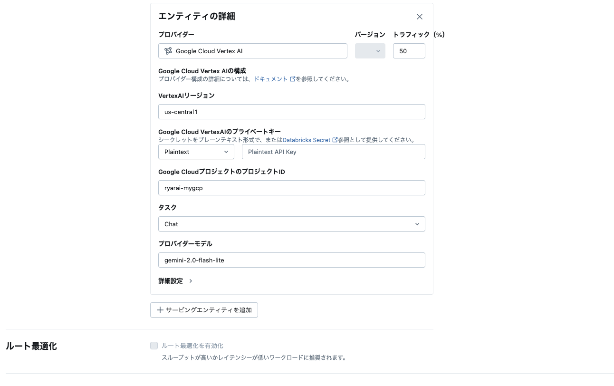

すぐに使えるようになっていて、他の内蔵モデルと比較してみたりできました。
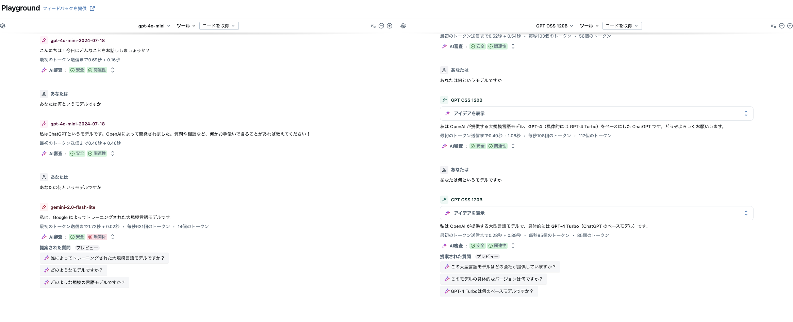

- ロードバランサー、サーキットブレーカー<br>
ロードバランシングは、トラフィックスプリッティングで、各モデルに割り当てるトラフィックの割合を指定する形でした。<br>
おそらくラウンドロビンで、以外のアルゴリズムは設定することができませんでした。<br>
フォールバックは、AI Gatewayセクションで「Enable fallbacks」を選択し、フォールバック先となるモデルを指定することで、トラフィック割合を0%に設定することで、通常はリクエストを受けず、障害時のみ利用されます。<br>

- ログ<br>
推論テーブルの中に入っていました。下記のように参照可能です。
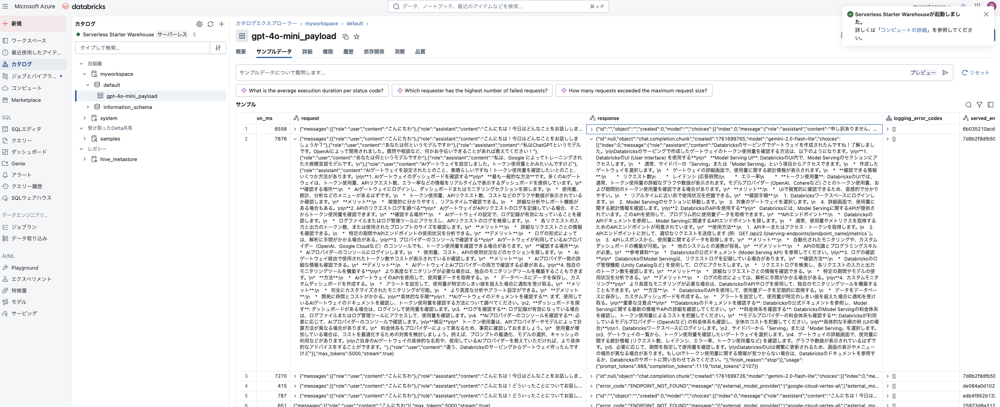

- 利用状況サマリ<br>
GithubからダッシュボードのサンプルJSONをダウンロードして、ダッシュボードで読み込んでね、とのことでした。<br>
権限の問題で参照できませんでしたが、内部的にはusage trackingやpayload loggingというテーブルに格納されているようで、コストや利用状況の可視化はできるようです。

その他<br>
- MCPサーバ：マネージドMCPサーバー、外部MCPサーバー、カスタムMCPサーバーの３種類をサポート（ベータ版とあり利用はできず）<br>
 内容的にMCPゲートウェイと思われます。<br>
 https://learn.microsoft.com/ja-jp/azure/databricks/generative-ai/mcp/#databricks-mcp-options<br>

- エージェント実行環境：Databricks Model Serving上で稼働します。Model ServingはDatabricksが提供するマネージドな推論基盤であり、エージェントのリクエスト処理やスケーリング、監視などを自動的に行います。デプロイ後は、AI Gatewayの推論テーブルやMLflowのトレース機能を使って、リクエストやレスポンス、エージェントの挙動をリアルタイムで監視・デバッグできます。とのこと。by databricks内のAIより<br>

- 独自モデルの学習環境など：生成AI向けmlflowがマネージドで提供されるため、トレーニングやサービングに必要な機能が一式利用可能。<br>

