# Langfuse ER図

## データベース関係図

```mermaid
erDiagram
    User ||--o{ Account : "has"
    User ||--o{ Session : "has"
    User ||--o{ OrganizationMembership : "belongs to"
    User ||--o{ ProjectMembership : "belongs to"
    User ||--o{ MembershipInvitation : "invited by"
    User ||--o{ Survey : "responds to"
    User ||--o{ Dashboard : "creates"
    User ||--o{ DashboardWidget : "creates"
    User ||--o{ TableViewPreset : "creates"
    User ||--o{ AnnotationQueueItem : "annotates"
    User ||--o{ AnnotationQueueAssignment : "assigned to"

    Organization ||--o{ OrganizationMembership : "has"
    Organization ||--o{ Project : "contains"
    Organization ||--o{ MembershipInvitation : "invites to"
    Organization ||--o{ ApiKey : "has"
    Organization ||--o{ Survey : "belongs to"
    Organization ||--o{ CloudSpendAlert : "has"

    Project ||--o{ ProjectMembership : "has"
    Project ||--o{ ApiKey : "has"
    Project ||--o{ TraceSession : "contains"
    Project ||--o{ LegacyPrismaTrace : "contains"
    Project ||--o{ LegacyPrismaObservation : "contains"
    Project ||--o{ LegacyPrismaScore : "contains"
    Project ||--o{ Dataset : "contains"
    Project ||--o{ DatasetItem : "contains"
    Project ||--o{ DatasetRuns : "contains"
    Project ||--o{ Prompt : "contains"
    Project ||--o{ Model : "contains"
    Project ||--o{ ScoreConfig : "contains"
    Project ||--o{ AnnotationQueue : "contains"
    Project ||--o{ AnnotationQueueItem : "contains"
    Project ||--o{ Comment : "contains"
    Project ||--o{ Media : "contains"
    Project ||--o{ TraceMedia : "contains"
    Project ||--o{ ObservationMedia : "contains"
    Project ||--o{ LlmApiKeys : "has"
    Project ||--o{ DefaultLlmModel : "has"
    Project ||--o{ EvalTemplate : "contains"
    Project ||--o{ JobConfiguration : "contains"
    Project ||--o{ JobExecution : "contains"
    Project ||--o{ PosthogIntegration : "has"
    Project ||--o{ BlobStorageIntegration : "has"
    Project ||--o{ BatchExport : "has"
    Project ||--o{ LlmSchema : "contains"
    Project ||--o{ LlmTool : "contains"
    Project ||--o{ Dashboard : "contains"
    Project ||--o{ DashboardWidget : "contains"
    Project ||--o{ TableViewPreset : "contains"
    Project ||--o{ Action : "contains"
    Project ||--o{ Trigger : "contains"
    Project ||--o{ Automation : "contains"
    Project ||--o{ AutomationExecution : "contains"
    Project ||--o{ SlackIntegration : "has"
    Project ||--o{ PendingDeletion : "has"
    Project ||--o{ AnnotationQueueAssignment : "contains"

    OrganizationMembership ||--o{ ProjectMembership : "extends to"

    Dataset ||--o{ DatasetItem : "contains"
    Dataset ||--o{ DatasetRuns : "has"

    DatasetRuns ||--o{ DatasetRunItems : "contains"
    DatasetItem ||--o{ DatasetRunItems : "included in"

    Prompt ||--o{ PromptDependency : "depends on"
    Prompt ||--o{ PromptProtectedLabels : "protects"

    ScoreConfig ||--o{ LegacyPrismaScore : "configures"

    AnnotationQueue ||--o{ AnnotationQueueItem : "contains"
    AnnotationQueue ||--o{ AnnotationQueueAssignment : "assigns"

    Media ||--o{ TraceMedia : "linked to"
    Media ||--o{ ObservationMedia : "linked to"

    EvalTemplate ||--o{ JobConfiguration : "used by"
    EvalTemplate ||--o{ JobExecution : "executed as"

    JobConfiguration ||--o{ JobExecution : "executes"

    LlmApiKeys ||--o{ DefaultLlmModel : "used by"

    Trigger ||--o{ Automation : "triggers"
    Action ||--o{ Automation : "performs"

    Automation ||--o{ AutomationExecution : "executes"

    User {
        string id PK
        string name
        string email UK
        datetime emailVerified
        string password
        string image
        boolean admin
        string[] featureFlags
        datetime createdAt
        datetime updatedAt
    }

    Organization {
        string id PK
        string name
        json cloudConfig
        json metadata
        datetime cloudBillingCycleAnchor
        int cloudCurrentCycleUsage
        boolean aiFeaturesEnabled
        datetime createdAt
        datetime updatedAt
    }

    Project {
        string id PK
        string orgId FK
        string name
        int retentionDays
        json metadata
        datetime deletedAt
        datetime createdAt
        datetime updatedAt
    }

    LegacyPrismaTrace {
        string id PK
        string externalId
        datetime timestamp
        string name
        string userId
        json metadata
        string projectId FK
        boolean public
        boolean bookmarked
        string[] tags
        json input
        json output
        string sessionId
        datetime createdAt
        datetime updatedAt
    }

    LegacyPrismaObservation {
        string id PK
        string traceId
        string projectId FK
        string type
        datetime startTime
        datetime endTime
        string name
        json metadata
        string parentObservationId
        string level
        string statusMessage
        string model
        json input
        json output
        int promptTokens
        int completionTokens
        int totalTokens
        decimal inputCost
        decimal outputCost
        decimal totalCost
        datetime createdAt
        datetime updatedAt
    }

    Dataset {
        string id PK
        string projectId FK
        string name
        string description
        json metadata
        string remoteExperimentUrl
        json remoteExperimentPayload
        datetime createdAt
        datetime updatedAt
    }

    DatasetItem {
        string id PK
        string projectId FK
        string status
        json input
        json expectedOutput
        json metadata
        string sourceTraceId
        string sourceObservationId
        string datasetId FK
        datetime createdAt
        datetime updatedAt
    }

    Prompt {
        string id PK
        string projectId FK
        string createdBy
        json prompt
        string name
        int version
        string type
        boolean isActive
        json config
        string[] tags
        string[] labels
        string commitMessage
        datetime createdAt
        datetime updatedAt
    }

    ScoreConfig {
        string id PK
        string projectId FK
        string name
        string dataType
        boolean isArchived
        float minValue
        float maxValue
        json categories
        string description
        datetime createdAt
        datetime updatedAt
    }

    LegacyPrismaScore {
        string id PK
        string projectId FK
        string name
        float value
        string source
        string authorUserId
        string comment
        string traceId
        string observationId
        string configId FK
        string stringValue
        string dataType
        datetime timestamp
        datetime createdAt
        datetime updatedAt
    }

    Media {
        string id PK
        string sha256Hash
        string projectId FK
        datetime uploadedAt
        int uploadHttpStatus
        string uploadHttpError
        string bucketPath
        string bucketName
        string contentType
        bigint contentLength
        datetime createdAt
        datetime updatedAt
    }

    Dashboard {
        string id PK
        string projectId FK
        string name
        string description
        json definition
        json filters
        string createdBy
        string updatedBy
        datetime createdAt
        datetime updatedAt
    }

    DashboardWidget {
        string id PK
        string projectId FK
        string name
        string description
        string view
        json dimensions
        json metrics
        json filters
        string chartType
        json chartConfig
        string createdBy
        string updatedBy
        datetime createdAt
        datetime updatedAt
    }

    Action {
        string id PK
        string projectId FK
        string type
        json config
        datetime createdAt
        datetime updatedAt
    }

    Trigger {
        string id PK
        string projectId FK
        string eventSource
        string[] eventActions
        json filter
        string status
        datetime createdAt
        datetime updatedAt
    }

    Automation {
        string id PK
        string name
        string triggerId FK
        string actionId FK
        string projectId FK
        datetime createdAt
    }

    LlmApiKeys {
        string id PK
        string projectId FK
        string provider
        string adapter
        string displaySecretKey
        string secretKey
        string baseURL
        string[] customModels
        boolean withDefaultModels
        string extraHeaders
        json config
        datetime createdAt
        datetime updatedAt
    }

    SlackIntegration {
        string id PK
        string projectId FK
        string teamId
        string teamName
        string botToken
        string botUserId
        datetime createdAt
        datetime updatedAt
    }
```

## 主要なリレーションシップ

### 1. 階層構造
- **Organization** → **Project** → **各種リソース**
- **LegacyPrismaTrace** → **LegacyPrismaObservation** (階層的)
- **Dataset** → **DatasetItem** → **DatasetRunItems**

### 2. 多対多関係
- **User** ↔ **Organization** (OrganizationMembership経由)
- **User** ↔ **Project** (ProjectMembership経由)
- **DatasetItem** ↔ **DatasetRuns** (DatasetRunItems経由)

### 3. 外部キー制約
- すべてのテーブルに適切な外部キー制約が設定
- カスケード削除の設定
- インデックスの最適化

### 4. データベース設計の特徴
- **階層的データ構造**: 組織 → プロジェクト → リソース
- **バージョン管理**: プロンプト、評価テンプレート
- **柔軟なメタデータ**: JSON形式での拡張性
- **監査ログ**: 変更履歴の追跡
- **権限管理**: ロールベースのアクセス制御
- **自動化**: トリガーとアクションによるワークフロー

この構成により、LangfuseはLLMアプリケーションの包括的な可観測性と分析を効率的に提供できるようになっています。
