# LiteLLM データベース ER図

このドキュメントは、LiteLLMプラットフォームのデータベースER図をMermaid形式で提供します。

## 主要なエンティティとリレーションシップ

```mermaid
erDiagram
    LiteLLM_BudgetTable {
        string budget_id PK
        float max_budget
        float soft_budget
        int max_parallel_requests
        bigint tpm_limit
        bigint rpm_limit
        json model_max_budget
        string budget_duration
        datetime budget_reset_at
        datetime created_at
        string created_by
        datetime updated_at
        string updated_by
    }

    LiteLLM_OrganizationTable {
        string organization_id PK
        string organization_alias
        string budget_id FK
        json metadata
        string[] models
        float spend
        json model_spend
        string object_permission_id FK
        datetime created_at
        string created_by
        datetime updated_at
        string updated_by
    }

    LiteLLM_TeamTable {
        string team_id PK
        string team_alias
        string organization_id FK
        string object_permission_id FK
        string[] admins
        string[] members
        json members_with_roles
        json metadata
        float max_budget
        float spend
        string[] models
        int max_parallel_requests
        bigint tpm_limit
        bigint rpm_limit
        string budget_duration
        datetime budget_reset_at
        boolean blocked
        json model_spend
        json model_max_budget
        string[] team_member_permissions
        int model_id FK
        datetime created_at
        datetime updated_at
    }

    LiteLLM_UserTable {
        string user_id PK
        string user_alias
        string team_id FK
        string sso_user_id UK
        string organization_id FK
        string object_permission_id FK
        string password
        string[] teams
        string user_role
        float max_budget
        float spend
        string user_email
        string[] models
        json metadata
        int max_parallel_requests
        bigint tpm_limit
        bigint rpm_limit
        string budget_duration
        datetime budget_reset_at
        string[] allowed_cache_controls
        json model_spend
        json model_max_budget
        datetime created_at
        datetime updated_at
    }

    LiteLLM_VerificationToken {
        string token PK
        string key_name
        string key_alias
        boolean soft_budget_cooldown
        float spend
        datetime expires
        string[] models
        json aliases
        json config
        string user_id FK
        string team_id FK
        json permissions
        int max_parallel_requests
        json metadata
        boolean blocked
        bigint tpm_limit
        bigint rpm_limit
        float max_budget
        string budget_duration
        datetime budget_reset_at
        string[] allowed_cache_controls
        string[] allowed_routes
        json model_spend
        json model_max_budget
        string budget_id FK
        string organization_id FK
        string object_permission_id FK
        datetime created_at
        string created_by
        datetime updated_at
        string updated_by
        int rotation_count
        boolean auto_rotate
        string rotation_interval
        datetime last_rotation_at
        datetime key_rotation_at
    }

    LiteLLM_ObjectPermissionTable {
        string object_permission_id PK
        string[] mcp_servers
        string[] mcp_access_groups
        json mcp_tool_permissions
        string[] vector_stores
    }

    LiteLLM_ModelTable {
        int id PK
        json model_aliases
        datetime created_at
        string created_by
        datetime updated_at
        string updated_by
    }

    LiteLLM_EndUserTable {
        string user_id PK
        string alias
        float spend
        string allowed_model_region
        string default_model
        string budget_id FK
        boolean blocked
    }

    LiteLLM_TagTable {
        string tag_name PK
        string description
        string[] models
        json model_info
        float spend
        string budget_id FK
        datetime created_at
        string created_by
        datetime updated_at
    }

    LiteLLM_TeamMembership {
        string user_id PK
        string team_id PK
        float spend
        string budget_id FK
    }

    LiteLLM_OrganizationMembership {
        string user_id PK
        string organization_id PK
        string user_role
        float spend
        string budget_id FK
        datetime created_at
        datetime updated_at
    }

    LiteLLM_SpendLogs {
        string request_id PK
        string call_type
        string api_key
        float spend
        int total_tokens
        int prompt_tokens
        int completion_tokens
        datetime startTime
        datetime endTime
        datetime completionStartTime
        string model
        string model_id
        string model_group
        string custom_llm_provider
        string api_base
        string user
        json metadata
        string cache_hit
        string cache_key
        json request_tags
        string team_id
        string end_user
        string requester_ip_address
        json messages
        json response
        string session_id
        string status
        string mcp_namespaced_tool_name
        json proxy_server_request
    }

    LiteLLM_ErrorLogs {
        string request_id PK
        datetime startTime
        datetime endTime
        string api_base
        string model_group
        string litellm_model_name
        string model_id
        json request_kwargs
        string exception_type
        string exception_string
        string status_code
    }

    LiteLLM_AuditLog {
        string id PK
        datetime updated_at
        string changed_by
        string changed_by_api_key
        string action
        string table_name
        string object_id
        json before_value
        json updated_values
    }

    LiteLLM_DailyUserSpend {
        string id PK
        string user_id
        string date
        string api_key
        string model
        string model_group
        string custom_llm_provider
        string mcp_namespaced_tool_name
        bigint prompt_tokens
        bigint completion_tokens
        bigint cache_read_input_tokens
        bigint cache_creation_input_tokens
        float spend
        bigint api_requests
        bigint successful_requests
        bigint failed_requests
        datetime created_at
        datetime updated_at
    }

    LiteLLM_DailyTeamSpend {
        string id PK
        string team_id
        string date
        string api_key
        string model
        string model_group
        string custom_llm_provider
        string mcp_namespaced_tool_name
        bigint prompt_tokens
        bigint completion_tokens
        bigint cache_read_input_tokens
        bigint cache_creation_input_tokens
        float spend
        bigint api_requests
        bigint successful_requests
        bigint failed_requests
        datetime created_at
        datetime updated_at
    }

    LiteLLM_DailyTagSpend {
        string id PK
        string tag
        string date
        string api_key
        string model
        string model_group
        string custom_llm_provider
        string mcp_namespaced_tool_name
        bigint prompt_tokens
        bigint completion_tokens
        bigint cache_read_input_tokens
        bigint cache_creation_input_tokens
        float spend
        bigint api_requests
        bigint successful_requests
        bigint failed_requests
        datetime created_at
        datetime updated_at
    }

    LiteLLM_ManagedFileTable {
        string id PK
        string unified_file_id UK
        json file_object
        json model_mappings
        string[] flat_model_file_ids
        datetime created_at
        string created_by
        datetime updated_at
        string updated_by
    }

    LiteLLM_ManagedObjectTable {
        string id PK
        string unified_object_id UK
        string model_object_id UK
        json file_object
        string file_purpose
        string status
        datetime created_at
        string created_by
        datetime updated_at
        string updated_by
    }

    LiteLLM_ManagedVectorStoresTable {
        string vector_store_id PK
        string custom_llm_provider
        string vector_store_name
        string vector_store_description
        json vector_store_metadata
        datetime created_at
        datetime updated_at
        string litellm_credential_name
        json litellm_params
    }

    LiteLLM_GuardrailsTable {
        string guardrail_id PK
        string guardrail_name UK
        json litellm_params
        json guardrail_info
        datetime created_at
        datetime updated_at
    }

    LiteLLM_PromptTable {
        string id PK
        string prompt_id UK
        json litellm_params
        json prompt_info
        datetime created_at
        datetime updated_at
    }

    LiteLLM_MCPServerTable {
        string server_id PK
        string server_name
        string alias
        string description
        string url
        string transport
        string auth_type
        datetime created_at
        string created_by
        datetime updated_at
        string updated_by
        json mcp_info
        string[] mcp_access_groups
        string[] allowed_tools
        string[] extra_headers
        string status
        datetime last_health_check
        string health_check_error
        string command
        string[] args
        json env
    }

    LiteLLM_HealthCheckTable {
        string health_check_id PK
        string model_name
        string model_id
        string status
        int healthy_count
        int unhealthy_count
        string error_message
        float response_time_ms
        json details
        string checked_by
        datetime checked_at
        datetime created_at
        datetime updated_at
    }

    LiteLLM_CronJob {
        string cronjob_id PK
        string pod_id
        string status
        datetime last_updated
        datetime ttl
    }

    LiteLLM_InvitationLink {
        string id PK
        string user_id FK
        boolean is_accepted
        datetime accepted_at
        datetime expires_at
        datetime created_at
        string created_by FK
        datetime updated_at
        string updated_by FK
    }

    LiteLLM_UserNotifications {
        string request_id PK
        string user_id
        string[] models
        string justification
        string status
    }

    LiteLLM_Config {
        string param_name PK
        json param_value
    }

    LiteLLM_CredentialsTable {
        string credential_id PK
        string credential_name UK
        json credential_values
        json credential_info
        datetime created_at
        string created_by
        datetime updated_at
        string updated_by
    }

    LiteLLM_ProxyModelTable {
        string model_id PK
        string model_name
        json litellm_params
        json model_info
        datetime created_at
        string created_by
        datetime updated_at
        string updated_by
    }

    %% リレーションシップ
    LiteLLM_BudgetTable ||--o{ LiteLLM_OrganizationTable : "budget_id"
    LiteLLM_BudgetTable ||--o{ LiteLLM_VerificationToken : "budget_id"
    LiteLLM_BudgetTable ||--o{ LiteLLM_EndUserTable : "budget_id"
    LiteLLM_BudgetTable ||--o{ LiteLLM_TagTable : "budget_id"
    LiteLLM_BudgetTable ||--o{ LiteLLM_TeamMembership : "budget_id"
    LiteLLM_BudgetTable ||--o{ LiteLLM_OrganizationMembership : "budget_id"

    LiteLLM_OrganizationTable ||--o{ LiteLLM_TeamTable : "organization_id"
    LiteLLM_OrganizationTable ||--o{ LiteLLM_UserTable : "organization_id"
    LiteLLM_OrganizationTable ||--o{ LiteLLM_VerificationToken : "organization_id"
    LiteLLM_OrganizationTable ||--o{ LiteLLM_OrganizationMembership : "organization_id"

    LiteLLM_TeamTable ||--o{ LiteLLM_UserTable : "team_id"
    LiteLLM_TeamTable ||--o{ LiteLLM_VerificationToken : "team_id"
    LiteLLM_TeamTable ||--o{ LiteLLM_TeamMembership : "team_id"
    LiteLLM_TeamTable ||--o{ LiteLLM_ModelTable : "model_id"

    LiteLLM_UserTable ||--o{ LiteLLM_VerificationToken : "user_id"
    LiteLLM_UserTable ||--o{ LiteLLM_TeamMembership : "user_id"
    LiteLLM_UserTable ||--o{ LiteLLM_OrganizationMembership : "user_id"
    LiteLLM_UserTable ||--o{ LiteLLM_InvitationLink : "user_id (CreatedBy)"
    LiteLLM_UserTable ||--o{ LiteLLM_InvitationLink : "user_id (UpdatedBy)"
    LiteLLM_UserTable ||--o{ LiteLLM_InvitationLink : "user_id (UserId)"

    LiteLLM_ObjectPermissionTable ||--o{ LiteLLM_OrganizationTable : "object_permission_id"
    LiteLLM_ObjectPermissionTable ||--o{ LiteLLM_TeamTable : "object_permission_id"
    LiteLLM_ObjectPermissionTable ||--o{ LiteLLM_UserTable : "object_permission_id"
    LiteLLM_ObjectPermissionTable ||--o{ LiteLLM_VerificationToken : "object_permission_id"
```

## 主要なリレーションシップの説明

### 1. 予算管理
- `LiteLLM_BudgetTable` が中心となり、組織、APIキー、エンドユーザー、タグ、チームメンバーシップ、組織メンバーシップに予算を割り当て

### 2. 組織・チーム・ユーザー階層
- 組織 → チーム → ユーザーの階層構造
- 各レベルで予算と権限を管理

### 3. APIキー管理
- `LiteLLM_VerificationToken` がユーザー、チーム、組織、予算、オブジェクト権限と関連
- キーローテーション機能をサポート

### 4. 支出追跡
- リアルタイム支出ログ（`LiteLLM_SpendLogs`）
- 日次集計（ユーザー、チーム、タグ別）
- 監査ログ（`LiteLLM_AuditLog`）

### 5. ファイル・オブジェクト管理
- 統一ファイルIDによる管理
- ベクターストア管理
- バッチ・ファインチューニングジョブ管理

### 6. セキュリティ・権限
- オブジェクトレベル権限管理
- MCPサーバー・ツール権限
- ガードレール・プロンプト管理

### 7. 監視・ヘルスチェック
- モデルヘルスチェック
- cronジョブ管理
- エラーログ追跡

このER図により、LiteLLMプラットフォームの複雑なデータ構造とリレーションシップを視覚的に理解できます。
